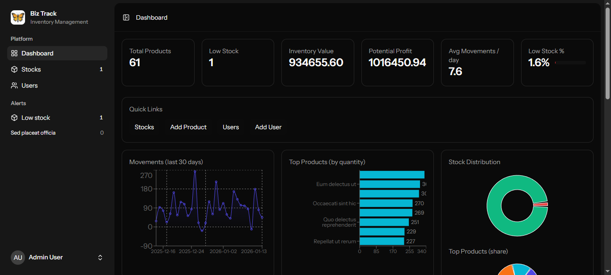
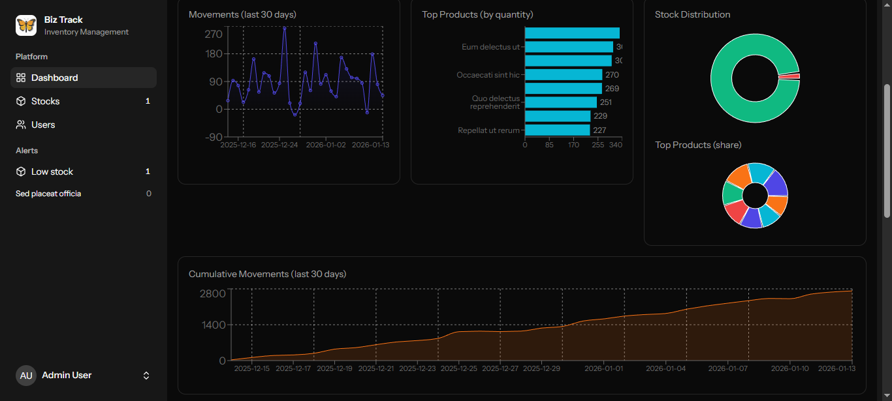
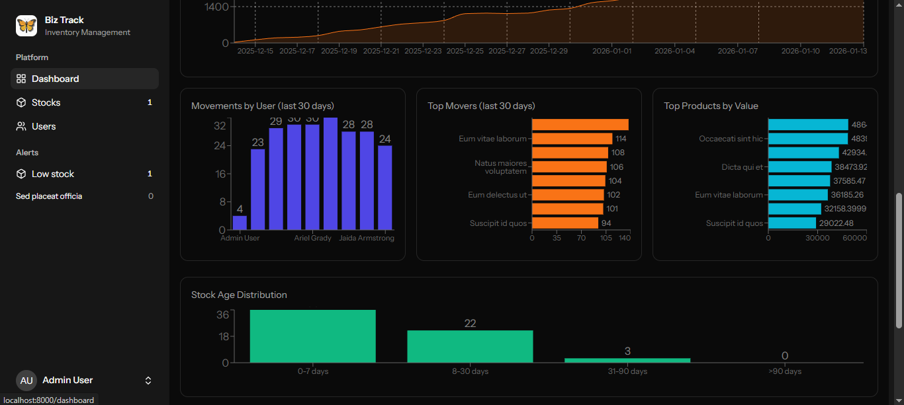
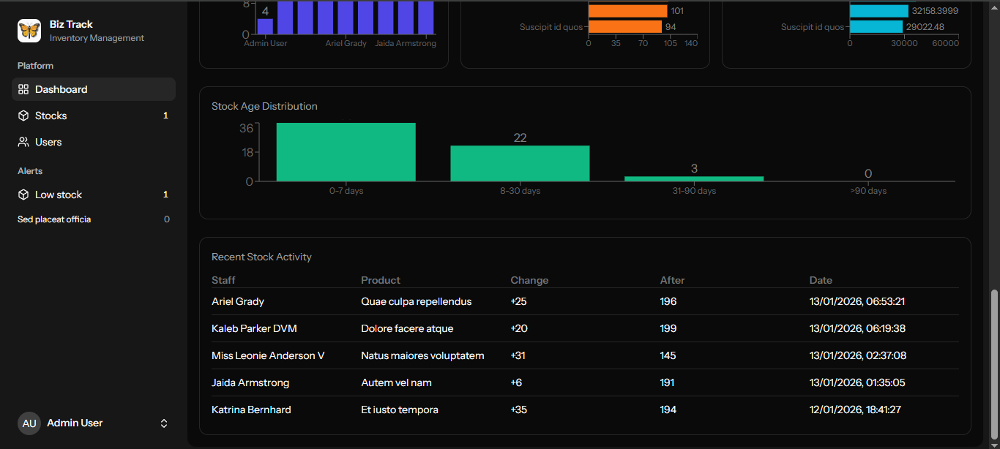

# BizTrack Admin

A clean, modern inventory/admin panel built with Laravel, Inertia (React + TypeScript), Tailwind CSS, and Recharts. It manages Stocks, Users and provides a rich Dashboard with charts and demo data support.

> Friendly, practical, and ready for development — drop your screenshots into `docs/screenshots/` and update the placeholders below.

---

## Quick highlights ✅

- Laravel + Inertia + React (TypeScript)
- Tailwind CSS for styling
- Recharts for charts and dashboards
- Demo data via `DemoSeeder` (safe to run in local/demo environments)
- Tests: Pest (PHP); linting and static analysis recommended

---

## Quick start (development)

1. Clone & install

```bash
git clone <repo-url>
cd biztrack-admin
composer install
npm install
# or use pnpm/yarn
```

2. Environment

```bash
cp .env.example .env
# Fill DB and mail credentials
php artisan key:generate
```

3. Migrate & seed

```bash
php artisan migrate
php artisan db:seed
# Demo seeding only in local or if DEMO_SEED=true
php artisan db:seed --class=DemoSeeder
```

4. Frontend

```bash
npm run dev   # vite dev server
npm run build # production build
```

5. Tests

```bash
vendor/bin/pest
```

6. Lint / static analysis (recommended)

- ESLint / Prettier for JS/TS
- PHPStan / Psalm for PHP
- Run `depcheck` (JS) and `composer-unused` (PHP) in CI/local before pruning deps

---

## Project layout 🔎

- `app/` — Laravel backend (controllers, models, services)
  - `app/Http/Controllers/DashboardController.php` — dashboard metrics
  - `app/Models/Stock.php`, `StockMovement.php`
- `resources/js/` — Inertia + React + TypeScript frontend
  - `resources/js/pages/` — pages (Dashboard, Stocks, Users)
  - `resources/js/components/` — UI components
- `database/` — migrations, factories, seeders
  - `database/seeders/DemoSeeder.php` — demo data generator (safe in local)
- `public/` — assets (favicon, logos)
- `tests/` — Pest tests

---

## Screenshots

Thanks — I found your screenshots in `docs/screenshots/` and added them below. Replace captions as you like.

```md

*Main dashboard with KPIs and interactive charts.*


*Stocks index showing quantities and low-stock highlights.*


*Stock history and movement timeline for a selected product.*


*Create / Edit stock form with validation and field hints.*
```

Suggested image sizes: hero 1200×700, detail 1000×600.

---

## Notes & implementation details 🧩

- Dashboard aggregates many metrics on the server to keep frontend rendering snappy (examples: `movementsByUser`, `topMovers`, `stockAgeBuckets`).
- `DemoSeeder` is guarded — it only runs safely when the app `APP_ENV` is `local` or `DEMO_SEED=true`.
- The logo component currently returns `/favicon.ico` in `resources/js/components/app-logo-icon.tsx`.

---

## Pruning unused things safely 🧹

1. Run `depcheck` and `composer-unused` locally or in CI to find unused packages.
2. Create a removals PR that deletes items and runs tests/lint.
3. Keep PRs small and add a changelog entry for removed packages.

I can automate these checks and create a PR if you want.

---

## Contributing & PR guidance 🤝

- Keep PRs small and focused.
- Run tests and linters before opening PRs.
- Add changelog lines for breaking changes or removed deps.

---

## License & Maintainers

- License: (add your preferred license)
- Maintainers: (add names/contact)

---

If you'd like, I can commit this `README.md` to a branch and open a PR with a short description and screenshots — say the word and I’ll do it.